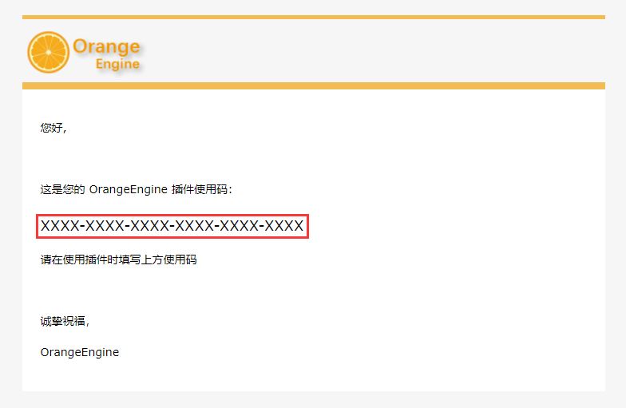

# 使用流程

:::tip 注意
在您购买后请务必阅读本章以及插件配置设置以确保插件可以正常使用
:::

## 注册

请先到[官网](https://engine.icecold.ltd)注册账号，在您注册后我们会向您的注册邮箱发送一封激活邮件，在激活账号后您会收到一个带有**使用码**的邮件(当您使用购买的CDK激活插件之后，请在插件内填写此码)

若丢失使用码可在官网重新发送包含使用码的邮件到注册邮箱

## 激活

在您购买后收到类似的两行字符串

>zFsM4RsU-ixJ6eCFYx7Jq3i10
>
>09cee7122deb91dac8cf05703ba824e6n2Q7PxcKlf1Hc4Ps

第一行(较短的一行)为**卡号**

第二行(较长的一行)为**卡密**

在官网登录您的账号后在激活账号处填写并提交，如图

## 绑定IP与端口

在激活插件后请到绑定IP界面设置您服务器的IP地址，一个账号可以绑定**两个**IP地址

支持填写``IPv4``或``域名``。

端口请填写``server.properties``文件内``server-port``设置的端口.

:::warning 注意
在您每次提交绑定IP后，过去下载的插件就会立即失效

使用中的插件部分功能就会失效但不会自动卸载

未加载的插件将无法验证
:::

## 下载插件

插件您需要在OrangeEngine官网进行下载，并且**每分钟**只能生成一次新插件，下载后您会得到一个名为"OrangeEngine-邮箱.zip"的压缩包，压缩包内为插件和文件校验码。

在您下载插件后建议对jar文件进行Hash校验以确保文件完整性, Mod请在QQ群文件内下载。

:::warning 注意
重新下载后以往下载的插件将会自动失效
:::

## 填写使用码

在您下载插件后请将插件jar放入服务器/plugins内后启动一次服务器生成配置文件。

之后在config.yml内填入您的邮箱以及使用码，详细可查看插件配置文件