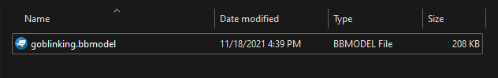
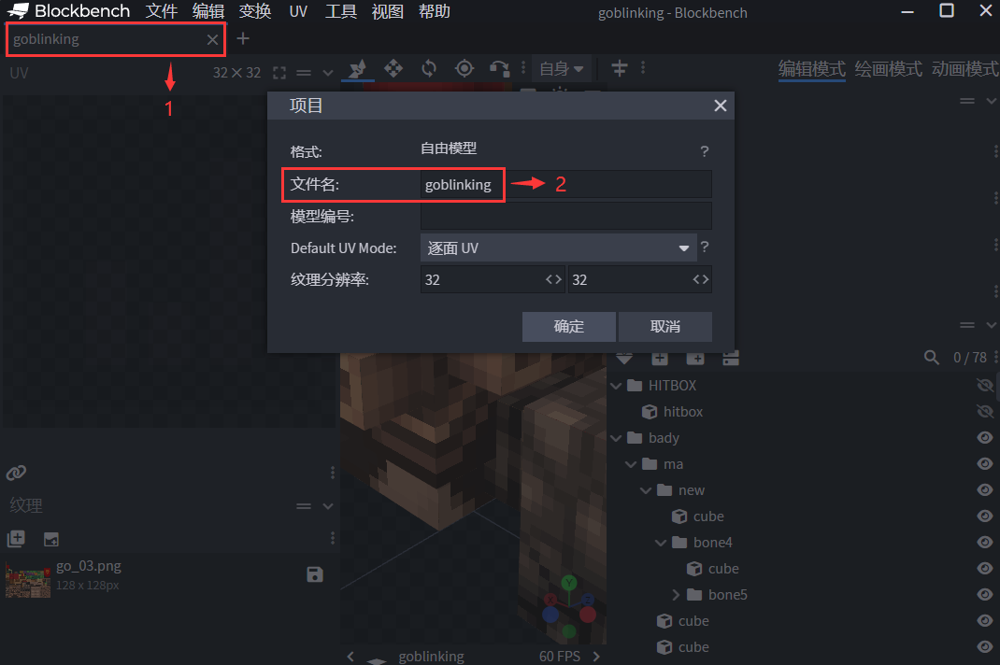
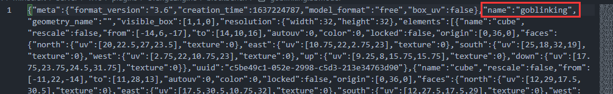

# 加载模型

## 第一步 放置模型文件

请先将需要加载的模型放入``OrangeEngine/blockbench``文件夹内



您可以在该文件夹内随意新建文件夹对模型文件进行分类，bbmodel文件名也可以随意修改，但模型文件内设置的模型名称需要遵循``[a-zA-Z0-9/._-]``的命名规则，否则会导致插件导出失败。

### 修改名称方法

以下两种方法二选一即可

#### 使用Blockbench修改

1. 双击``1``处即可打开下图窗口
2. 在``2``处修改名称，并点击确定
3. 按下``Ctrl + Alt + S``保存项目 或 点击``文件 - 保存项目``



#### 使用记事本修改

在使用记事本打开bbmodel文件后，可以看到``name``项，修改其中的值后保存即可。



## 第二步 导出资源包

在插件成功加载后，输入指令``/oe resource bb``即可开始导出资源文件。

在控制台中看到以下信息即为导出成功。


## 第三步 打包资源包

导出后的资源包位于``OrangeEngine/resources``，直接将resources中的所有文件压缩为``zip``文件后放入客户端资源包中，或者将``orangeengine``的命名空间文件夹放入``ItemsAdder``中打包。

## 第四步 客户端加载

在客户端读取资源包并连接服务器后，可以在客户端log文件中看到模型是否正确注册。

如果出现下面这种信息说明该模型已经**正常**加载

```log
[17:05:30] [orange-network-pool-2/INFO]: Registered model: goblinking
```

如果注册**错误**会出现下面的信息，请检查资源包内模型、动作、贴图文件是否正确存放。

```log
[17:05:30] [orange-network-pool-2/ERROR]: Register error. Could not find model json. Model: goblinking
```

## 第五步 使用模型

### CitizensNPC

为CitizensNPC的实体套模型需要安装群文件中``OrangeMechanic``插件，使用指令即可为NPC绑定模型。

[相关指令](../basics/command)

### Adyeshach

为Adyeshach的NPC套模型需要安装群文件中``OeModel-Adyeshach``插件，使用指令即可为NPC绑定模型。

输入指令``/oemodel``即可查询相关指令。

### MythicMobs

需要安装``OrangeMechanic``插件，即可使用相关标签。