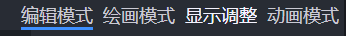
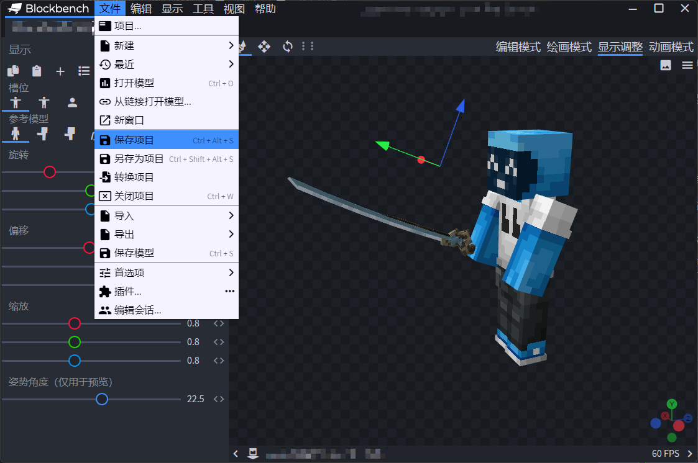

# 物品模型

## 配置文件

使用指令`/oe item create [Name]`可生成初始配置文件，配置文件在`OrangeEngine/model/item`内。

`Name` : 使用的模型名称

`Animation` : `Idle`为默认空闲动画，在左右手交互时播放`Interact`中设置的动画，在例如弓箭、弩的右键拉弓时会播放动画`Use`。
当玩家拉弓保持不动时会播放名为`Use`加`_static`的动画，例如 "use_static"

`Offhand` : 如果玩家手持该物品时（主手），可以自动在副手（仅当副手中没有物品时）渲染在`ItemModel.Offhand.Model`中设置的模型物品。

`Matching` : 当物品名或物品的Lore中包含目标文字则自动渲染该模型。

```yaml
ItemModel:
  Name: test
  Animation:
    Idle: idle
    Interact: interact
    Use: use
  Offhand:
    Enable: false
    Model: ''
  Matching:
    Name:
    - name1
    - name2
    Lore:
    - lore1
    - lore2
```

## 模型显示配置

请先安装群文件内的Blockbench插件.


在安装插件后，打开模型后会在右上角多出`显示调整`选项。如果没有显示请重新打开模型尝试。



在左侧直接调整物品显示位置即可


在调整完毕后请记得`保存项目`，然后将模型文件放置到插件的blockbench目录内，使用`/oe resource bb`指令生成物品配置文件。




## 使用模型

使用指令`/oe item bind [ModelName]`即可为主手中的模型绑定物品模型

## 播放其他动画

使用指令`/oe item play [AnimationName] [main/off]` 选择玩家主/副手中的物品播放指定动画