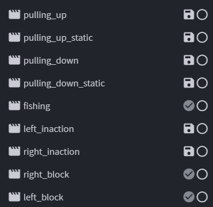

# 玩家动作

## 动作说明

玩家动作将分为两部分，上半身和腿部动作，其中up对应上半身，down对应腿部，用来适配类似 拉弓 + 走动 等场景。

同时由于手部物品可以在不同手中，因为动画也同时适配双手动画。

## 动作命名规则

完整动作名：(left/right_)动作名(_up/down)(_static)

left/right: 左手/右手

up/down: 上半身/下半身

static: 播放停止在最后一帧的动作

可以参考群文件中的玩家模型

