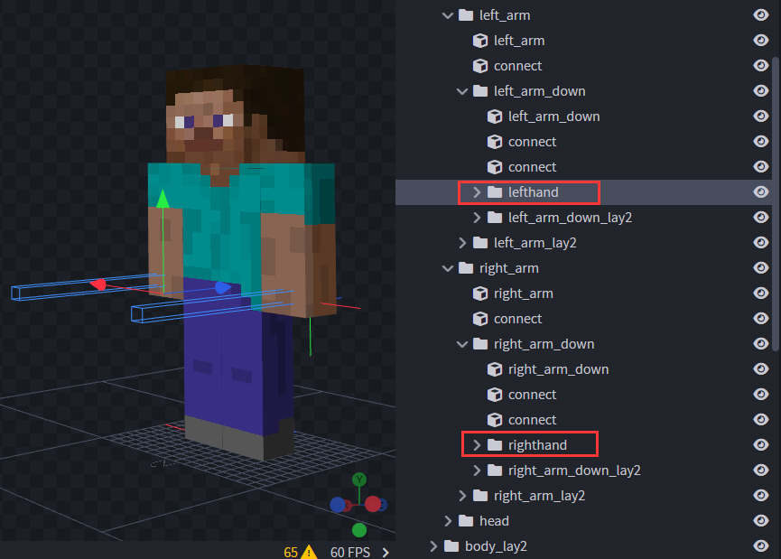

# 配置文件

:::warning 注意
玩家模型名请以player作为开头以便区分，Mod按照该规则进行区分
:::

在使用指令``/oe player create [ModelName]``生成配置文件前，需要已经使用``/oe resource bb``生成模型配置文件，并且插件已经加载该模型配置。插件在生成示例配置文件后需要根据实际模型进行调整。

文档将以群文件内``player.bbmodel``模型作为讲解示例。

### 手部物品绑定

```yaml
PlayerModel:
  Hand:
    Left:
      Name: lefthand
      Translate:
        X: -0.25
        Y: 0.15
        Z: 0
    Right:
      Name: righthand
      Translate:
        X: -0.15
        Y: 0
        Z: -0.25
```

打开``player.bbmodel``模型文件后可以找到史蒂夫双手的分组，将组名分别填入配置文件的``PlayerModel.Left.Name``与``PlayerModel.Right.Name``中。

进入游戏后如果发现物品渲染位置与想要位置有差异，可以通过调整``Translate``配置对物品进行平移调整。



### 盔甲绑定

如果模型不需要渲染原版盔甲，将以下设置留空即可。需要根据所用模型自行调整。

如果需要渲染较为完整的原版盔甲，最好将模型头部大小设置为8\*8\*8，躯干设置为4\*12\*4，胳膊与腿部为4\*12\*4。

```yaml
PlayerModel:
  ArmorModel:
    Head:
    - head_lay2
    LeftArm:
    - left_arm_lay2
    RightArm:
    - right_arm_lay2
    Body:
    - body_lay2
    LeftLeg:
    - left_leg_lay2
    RightLeg:
    - right_leg_lay2
    LeftFeet:
    - left_leg_down_lay2
    RightFeet:
    - right_leg_down_lay2
```

### 玩家模型默认动作

请将动作``基础名``填入配置文件。命名规则请仔细阅读[动作规则](./animation.md)

添加在``Movement``中添加的自定义动作将根据玩家的实际移动速度来计算动作的播放速度，内置的默认动作无需再次设置。

```yaml
PlayerModel:
  Animation:
    Movement:
    - run_attack
    Internal:
      Idle: idle
      Walk: walk
      Run: run
      Swim: swim
      Fly: fly
      Sneak: sneak
      Kneel: kneel
      Fall: fall
      Mount: mount
      Death: death
      Jump: jump
      Inaction: inaction
      Climb: climb
      Sleep: sleep
      None: idle
      Aim: pulling
      Block: block
      Eat: eat
      Float: float
```

### 不同动作修改碰撞箱大小

在播放动画时，有些动作需要动态修改碰撞箱大小，可在HitBox下添加配置。在播放该动作时实体碰撞箱将自动修改为配置值，播放完毕后自动恢复默认值。

格式：
```yaml
PlayerModel:
  HitBox:
    动作名:
      Width: 宽度
      Height: 高度
```
需要注意的是在修改内置动作时请使用配置项的大写，自定义动作正常填写其动作名即可无需调整为大写

例如内置的跑步动作配置为 ``Run: running`` ，如果需要将其配置为

```yaml
PlayerModel:
  HitBox:
    RUN:
      Width: 2
      Height: 2.5
```

### 使用玩家皮肤作为模型贴图

将``PlayerSkin``设置为``true``即可

```yaml
PlayerModel:
  PlayerSkin: true
```

### 玩家动画过度

玩家动画过度，单位(Tick)

```yaml
PlayerModel:
  Transition: 5
```

### FirstPersonMod兼容

为兼容第一人称MOD需要在配置文件中设置头部组名，设置后Mod在第一人称时将不再会渲染头部模型。

为适配不同高度玩家模型，可以在``CameraOffset``中设置摄像机偏移。

```yaml
PlayerModel:
  FirstPersonMod:
    Head: Head
    LeftArm: LeftArm
    RightArm: RightArm
    WithoutHead: true
    CameraOffset:
      X: 0.0
      Y: 0.25
      Z: 0.0
```

### 完整示例配置文件

```yaml
PlayerModel:
  Name: player
  PlayerSkin: true
  Transition: 5
  Hand:
    Left:
      Name: lefthand
      Translate:
        X: -0.25
        Y: 0.15
        Z: 0
    Right:
      Name: righthand
      Translate:
        X: -0.15
        Y: 0
        Z: -0.25
  HitBox:
    SWIM:
      Width: 0.6
      Height: 0.6
  ArmorModel:
    Head:
    - head_lay2
    LeftArm:
    - left_arm_lay2
    RightArm:
    - right_arm_lay2
    Body:
    - body_lay2
    LeftLeg:
    - left_leg_lay2
    RightLeg:
    - right_leg_lay2
    LeftFeet:
    - left_leg_down_lay2
    RightFeet:
    - right_leg_down_lay2
  Animation:
    Movement:
    - run_attack
    Internal:
      Idle: idle
      Walk: walk
      Run: run
      Swim: swim
      Fly: fly
      Sneak: sneak
      Kneel: kneel
      Fall: fall
      Mount: mount
      Death: death
      Jump: jump
      Inaction: inaction
      Climb: climb
      Sleep: sleep
      None: idle
      Aim: pulling
      Block: block
      Eat: eat
      Float: float
  FirstPersonMod:
    Head: h_head
    LeftArm: LeftArm
    RightArm: RightArm
    OnlyArm: false
    WithoutHead: true
    CameraOffset:
      X: 0.0
      Y: 0.25
      Z: 0.0

```